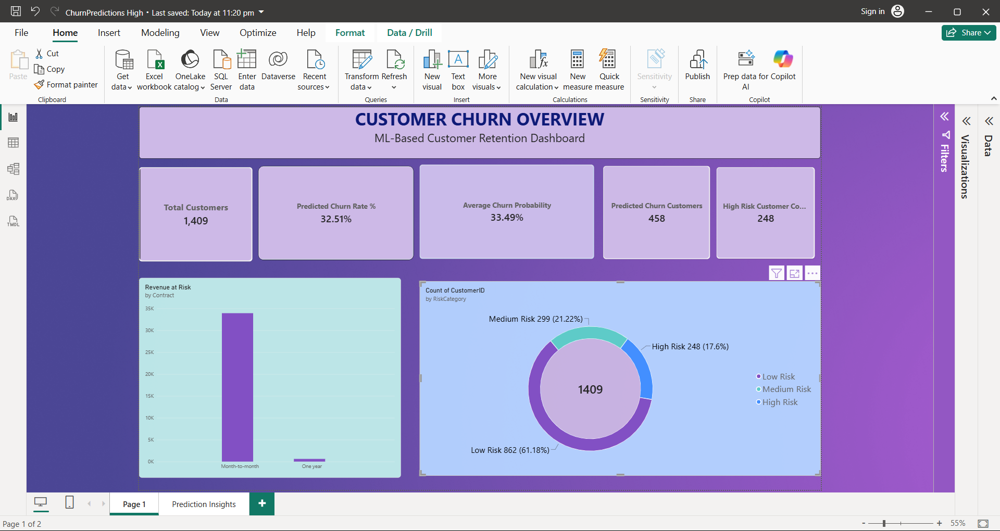
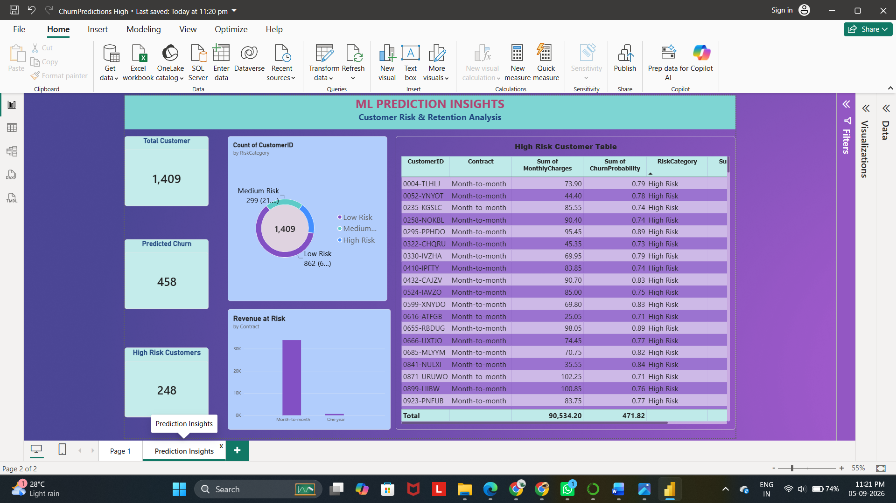
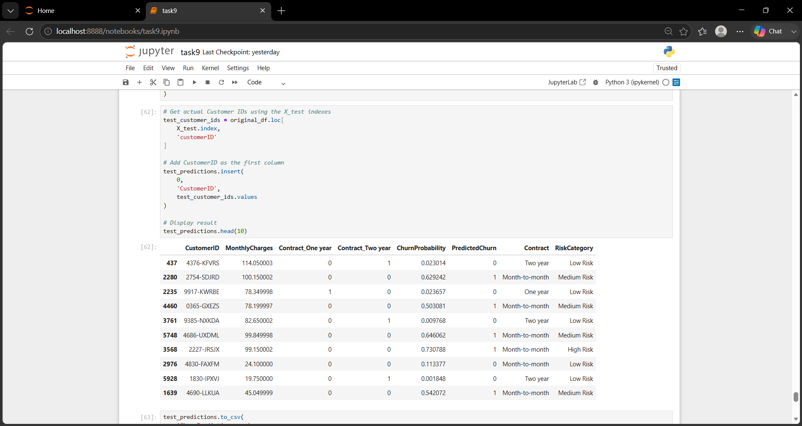
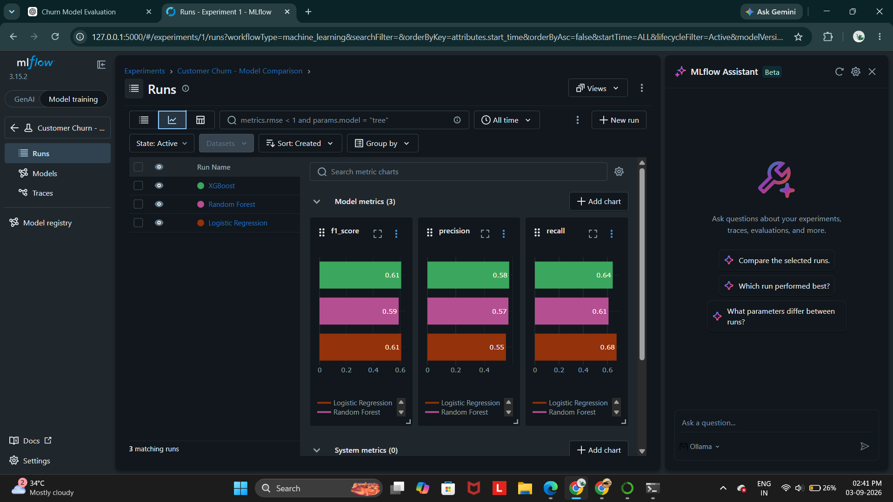
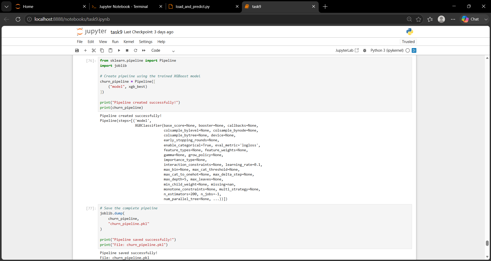

# 📊 Customer Churn Analysis & Prediction

## 📌 Project Overview

Customer churn is one of the major challenges faced by subscription-based businesses. Losing existing customers can reduce revenue and increase the cost of acquiring new customers.

This project focuses on analyzing customer churn data, identifying the major factors associated with customer churn, building machine learning models to predict customers who are likely to churn, and presenting the results through an interactive Power BI dashboard.

The project follows a complete end-to-end data analytics and machine learning workflow:

**SQL Server → Python → Machine Learning → MLflow → LIME → Power BI**

---

## 🎯 Project Objectives

The main objectives of this project are:

* Analyze customer churn patterns.
* Clean and prepare customer data using SQL.
* Perform Exploratory Data Analysis using Python.
* Identify important factors associated with customer churn.
* Build machine learning models for churn prediction.
* Handle class imbalance using SMOTE.
* Compare Logistic Regression, Random Forest, and XGBoost.
* Track machine learning experiments using MLflow.
* Explain model predictions using LIME.
* Build an interactive Power BI dashboard.
* Provide business-oriented insights from the predictions.

---

## 📂 Dataset

### Dataset Name

**Telco Customer Churn Dataset**

### Dataset Source

The project uses the publicly available Telco Customer Churn dataset.

The dataset contains information about customers, their services, account information, contract type, payment method, monthly charges, tenure, and churn status.

### Dataset Size

* **Customers:** 7,043
* **Original columns:** 21
* **Modeling dataset:** 20 source features after preparation
* **Target variable:** `Churn`

### Important Features

Some of the important customer attributes include:

* Customer ID
* Gender
* Senior Citizen
* Partner
* Dependents
* Tenure
* Phone Service
* Multiple Lines
* Internet Service
* Online Security
* Online Backup
* Device Protection
* Tech Support
* Streaming TV
* Streaming Movies
* Contract
* Paperless Billing
* Payment Method
* Monthly Charges
* Total Charges
* Churn

---

# 🛠️ Technologies Used

| Technology       | Purpose                                   |
| ---------------- | ----------------------------------------- |
| SQL Server       | Data cleaning, transformation and EDA     |
| Python           | Data analysis and preprocessing           |
| Pandas           | Data manipulation                         |
| NumPy            | Numerical operations                      |
| Scikit-learn     | Machine learning                          |
| SMOTE            | Handling class imbalance                  |
| XGBoost          | Gradient boosting model                   |
| MLflow           | Experiment tracking                       |
| LIME             | Model explainability                      |
| Power BI         | Interactive dashboard                     |
| Jupyter Notebook | Python development                        |
| GitHub           | Version control and project documentation |

---

# 🔄 Project Workflow

```text
                  Telco Customer Churn Dataset
                              │
                              ▼
                       SQL Server
                              │
                ┌─────────────┴─────────────┐
                │                           │
          Data Cleaning                Data EDA
                │                           │
                └─────────────┬─────────────┘
                              ▼
                       SQL Data View
                              │
                              ▼
                            Python
                              │
                    Data Preprocessing
                              │
                              ▼
                       Feature Engineering
                              │
                              ▼
                          SMOTE
                              │
                              ▼
                    Machine Learning Models
                              │
              ┌───────────────┼───────────────┐
              ▼               ▼               ▼
        Logistic Regression Random Forest    XGBoost
              │               │               │
              └───────────────┼───────────────┘
                              ▼
                           MLflow
                              │
                              ▼
                         LIME Analysis
                              │
                              ▼
                      Churn Predictions
                              │
                              ▼
                         Power BI
                              │
                              ▼
                    Business Insights
```

---

# 🗄️ 1. SQL Server Data Preparation

The dataset was imported into SQL Server and stored in the `ChurnDB` database.

### Database

```text
ChurnDB
```

### Table

```text
dbo.CustomerChurn
```

### SQL View

```text
vw_ChurnData
```

The SQL stage was used for:

* Data cleaning
* Handling missing values
* Data type conversion
* Checking duplicate records
* Creating derived categories
* Churn analysis
* Contract analysis
* Tenure analysis
* Charge analysis
* Internet service analysis

---

# 📈 2. SQL Exploratory Data Analysis

The overall churn distribution was:

| Customer Status | Customers |
| --------------- | --------: |
| No Churn        |     5,174 |
| Churn           |     1,869 |
| Total           |     7,043 |

### Overall Churn Rate

**26.54%**

This means that approximately one out of every four customers in the dataset had churned.

---

## Contract-wise Churn

| Contract       | Total Customers | Churned Customers | Churn Rate |
| -------------- | --------------: | ----------------: | ---------: |
| Month-to-month |           3,875 |             1,655 |     42.71% |
| One year       |           1,473 |               166 |     11.27% |
| Two year       |           1,695 |                48 |      2.83% |

Contract type was one of the important variables examined during the analysis.

---

## Tenure-wise Churn

| Tenure Group | Total Customers | Churned Customers | Churn Rate |
| ------------ | --------------: | ----------------: | ---------: |
| 0–12 months  |           2,186 |             1,037 |     47.44% |
| 13–24 months |           1,024 |               294 |     28.71% |
| 25–48 months |           1,594 |               325 |     20.39% |
| 49+ months   |           2,239 |               213 |      9.51% |

The analysis shows a strong difference in observed churn rates across tenure groups.

---

## Internet Service-wise Churn

| Internet Service | Total Customers | Churned Customers | Churn Rate |
| ---------------- | --------------: | ----------------: | ---------: |
| Fiber optic      |           3,096 |             1,297 |     41.89% |
| DSL              |           2,421 |               459 |     18.96% |
| No Internet      |           1,526 |               113 |      7.40% |

---

## Charge Category Analysis

| Charge Category | Churn Rate |
| --------------- | ---------: |
| High            |     35.48% |
| Medium          |     23.65% |
| Low             |     11.59% |

These are descriptive patterns in the dataset and do not by themselves establish causation.

---

# 🐍 3. Python Data Processing

The cleaned SQL view was loaded into Python using Pandas.

```python
SELECT * FROM vw_ChurnData
```

### Dataset Shape

```text
(7043, 20)
```

The dataset was checked for:

* Missing values
* Data types
* Duplicate records
* Numerical features
* Categorical features

Categorical variables were converted into numerical features using one-hot encoding.

After preprocessing:

```text
Processed dataset: (7043, 32)
Feature matrix X: (7043, 31)
```

---

# ⚙️ 4. Feature Engineering

Additional features were created to improve the analysis and modeling process.

### TotalServicesUsed

This feature represents the number of services used by a customer.

### AvgMonthlySpend

This feature represents the customer's average monthly spending based on the available customer/account information.

These engineered features were included in the machine learning dataset.

---

# 🤖 5. Machine Learning

The dataset was divided into training and testing sets.

### Train/Test Split

```text
Training samples: 5,634
Testing samples: 1,409
```

The target variable was:

```text
Churn
```

The following models were evaluated:

1. Logistic Regression
2. Random Forest
3. XGBoost

---

# ⚖️ 6. Handling Class Imbalance with SMOTE

The training data contained fewer churn cases than non-churn cases.

### Before SMOTE

```text
No Churn: 4,139
Churn:    1,495
```

SMOTE (Synthetic Minority Over-sampling Technique) was applied to the training data.

### After SMOTE

```text
No Churn: 4,139
Churn:    4,139
```

The test dataset was kept unchanged.

This helped provide a balanced training dataset while avoiding synthetic samples being introduced into the test set.

---

# 📊 7. Model Evaluation

The models were evaluated using:

* Precision
* Recall
* F1-score
* Cross-validation F1-score

## Model Comparison

| Model               | Precision | Recall | F1-score |
| ------------------- | --------: | -----: | -------: |
| Logistic Regression |    0.5524 | 0.6765 |   0.6082 |
| Random Forest       |    0.5700 | 0.6096 |   0.5891 |
| XGBoost             |    0.5752 | 0.6444 |   0.6078 |

The selected downstream prediction workflow used **Logistic Regression**.

### Logistic Regression Test Performance

```text
Precision : 0.5524
Recall    : 0.6765
F1-score  : 0.6082
```

The model was subsequently used to generate churn probabilities for customers.

---

# 🧪 8. MLflow Experiment Tracking

MLflow was used to track machine learning experiments.

The following information was logged during the modeling process:

* Model parameters
* Model metrics
* Model artifacts
* Experiment runs

Models evaluated through MLflow included:

* Logistic Regression
* Random Forest
* XGBoost

MLflow helped maintain a record of the experiments and their results.

---

# 🔍 9. LIME Model Explainability

LIME (Local Interpretable Model-Agnostic Explanations) was used to understand individual model predictions.

Instead of only displaying:

```text
Customer → High Churn Risk
```

LIME helps identify the features contributing to an individual prediction.

Examples of potentially influential customer attributes include:

* Contract type
* Monthly charges
* Tenure
* Internet service
* Payment method
* Services used

This makes the machine learning output easier to interpret from a business perspective.

---

# 📋 10. Churn Prediction Output

The model generated customer-level predictions containing fields such as:

| Column           | Description                  |
| ---------------- | ---------------------------- |
| CustomerID       | Customer identifier          |
| ChurnProbability | Probability of churn         |
| PredictedChurn   | Model prediction             |
| Contract         | Customer contract type       |
| RiskCategory     | Customer risk classification |

Example:

```text
CustomerID
ChurnProbability
PredictedChurn
Contract
RiskCategory
```

These predictions were then used in Power BI.

---

# 📊 11. Power BI Dashboard

An interactive Power BI dashboard was developed to present the analysis and prediction results.

The dashboard contains two main pages.

---

## Page 1 — Overview

The Overview page presents:

* Total Customers
* Churned Customers
* Overall Churn %
* Revenue-related metrics
* Churn by Contract
* Churn by Tenure Group
* Customer/service analysis

### Dashboard Screenshot

Add your final Power BI Overview screenshot here:

```markdown

```

---

# 📈 Page 2 — Prediction Insights

The Prediction Insights page presents machine-learning-based customer risk information.

It includes:

* Customer churn probability
* Predicted churn status
* Risk categories
* Contract-wise prediction analysis
* Revenue at risk
* High-risk customer count

### Dashboard Screenshot

```markdown

```

---

# 💰 Revenue at Risk

A prediction-based revenue metric was created using the monthly charges of customers predicted to churn.

Conceptually:

```text
Revenue at Risk
=
Sum of Monthly Charges
for customers predicted to churn
```

This allows the dashboard to connect machine learning predictions with a business-oriented financial metric.

---

# 📷 Project Screenshots

Store the final screenshots in a `Screenshots` folder.

Recommended files:

```text
Screenshots/
│
├── dashboard_overview.png
├── prediction_insights.png
├── model_evaluation.png
├── mlflow_experiment.png
└── lime_explanation.png
```

Then add them to this README.

### Model Evaluation

```markdown

```

### MLflow

```markdown

```

### LIME Explanation

```markdown

```

---

# ▶️ 12. How to Run the Project

## Step 1 — SQL Server

1. Install SQL Server.
2. Create the database:

```text
ChurnDB
```

3. Import the customer churn dataset.
4. Create the table:

```text
dbo.CustomerChurn
```

5. Clean and transform the data.
6. Create the SQL view:

```text
vw_ChurnData
```

---

## Step 2 — Python

Install the required Python packages:

```bash
pip install pandas numpy scikit-learn xgboost imbalanced-learn mlflow lime matplotlib seaborn
```

Open the Jupyter Notebook:

```bash
jupyter notebook
```

Run the notebook cells in order:

```text
SQL Data Loading
        ↓
Data Cleaning
        ↓
EDA
        ↓
Feature Engineering
        ↓
Train/Test Split
        ↓
SMOTE
        ↓
Model Training
        ↓
Model Evaluation
        ↓
Prediction
        ↓
LIME Explanation
```

---

## Step 3 — Power BI

1. Open Power BI Desktop.
2. Connect to SQL Server.
3. Select the required SQL view.
4. Load the churn prediction data.
5. Create the required DAX measures.
6. Build the Overview page.
7. Build the Prediction Insights page.
8. Add the final dashboard visuals.

---

# 📁 13. Suggested Repository Structure

```text
Customer-Churn-Analysis/
│
├── README.md
│
├── SQL/
│   ├── CustomerChurn.sql
│   └── vw_ChurnData.sql
│
├── Python/
│   ├── churn_analysis.ipynb
│   ├── churn_model.pkl
│   └── requirements.txt
│
├── PowerBI/
│   └── Customer_Churn_Dashboard.pbix
│
├── Screenshots/
│   ├── dashboard_overview.png
│   ├── prediction_insights.png
│   ├── model_evaluation.png
│   ├── mlflow_experiment.png
│   └── lime_explanation.png
│
└── .gitignore
```

---

# 📌 14. Key Findings

The exploratory analysis identified several notable patterns:

* Overall observed churn rate was **26.54%**.
* Month-to-month customers had a **42.71%** churn rate in this dataset.
* Customers with 0–12 months of tenure had a **47.44%** churn rate.
* Fiber optic customers had a **41.89%** churn rate.
* Customers in the high-charge category had a **35.48%** churn rate.
* Churn rates varied substantially across contract, tenure, internet service, and charge categories.

These findings describe associations in the dataset and can be used to identify areas for further business investigation.

---

# 🚀 15. Future Improvements

Possible extensions to this project include:

* Deploying the model using Streamlit.
* Adding real-time customer prediction.
* Containerizing the application using Docker.
* Deploying the application to a cloud platform.
* Adding automated model retraining.
* Monitoring model performance over time.
* Adding additional explainability techniques.
* Integrating the prediction system with a customer management platform.
* Improving the model using hyperparameter optimization and additional feature engineering.

---

# 🌐 16. Optional Streamlit Deployment

A Streamlit application can be created to allow users to enter customer information and receive a churn probability prediction.

Example workflow:

```text
Customer Details
       ↓
Streamlit Input Form
       ↓
Saved ML Pipeline
       ↓
Churn Probability
       ↓
Risk Category
```

Example output:

```text
Churn Probability: 78.4%

Predicted Churn: Yes

Risk Category: High Risk
```

---

# 🐳 17. Optional Docker Deployment

The Streamlit application can also be containerized using Docker.

Example workflow:

```text
Python Model
     ↓
Streamlit App
     ↓
Docker Image
     ↓
Docker Container
     ↓
Web Application
```

This makes the application easier to run consistently across different environments.

---

# 📚 18. Learning Outcomes

Through this project, I gained practical experience in:

* SQL data preparation
* Exploratory Data Analysis
* Python data processing
* Feature engineering
* Machine learning
* Class imbalance handling
* Model evaluation
* MLflow experiment tracking
* Model explainability using LIME
* Power BI dashboard development
* Business-oriented data interpretation
* End-to-end machine learning workflow
* Technical documentation

---

# 👨‍💻 Author

**Madhan**

Bachelor of Engineering / Technology in Computer Science and Engineering

---

# ⭐ Project Summary

This project demonstrates an end-to-end customer churn analytics and prediction solution.

```text
Raw Data
   ↓
SQL Cleaning & EDA
   ↓
Python Processing
   ↓
Feature Engineering
   ↓
SMOTE
   ↓
Machine Learning
   ↓
MLflow Tracking
   ↓
LIME Explainability
   ↓
Customer Predictions
   ↓
Power BI Dashboard
```

The project combines **data engineering, data analysis, machine learning, explainable AI, and business intelligence** into a single workflow.
